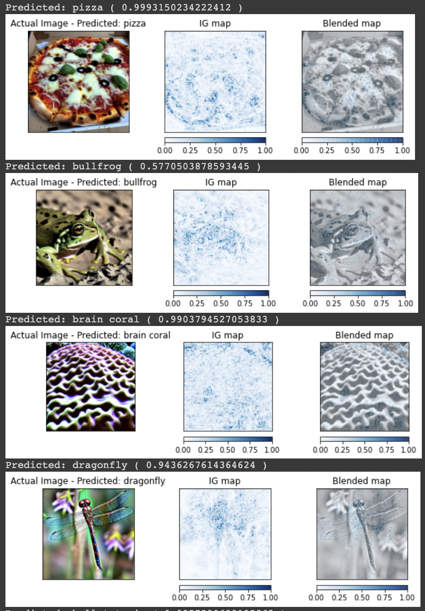
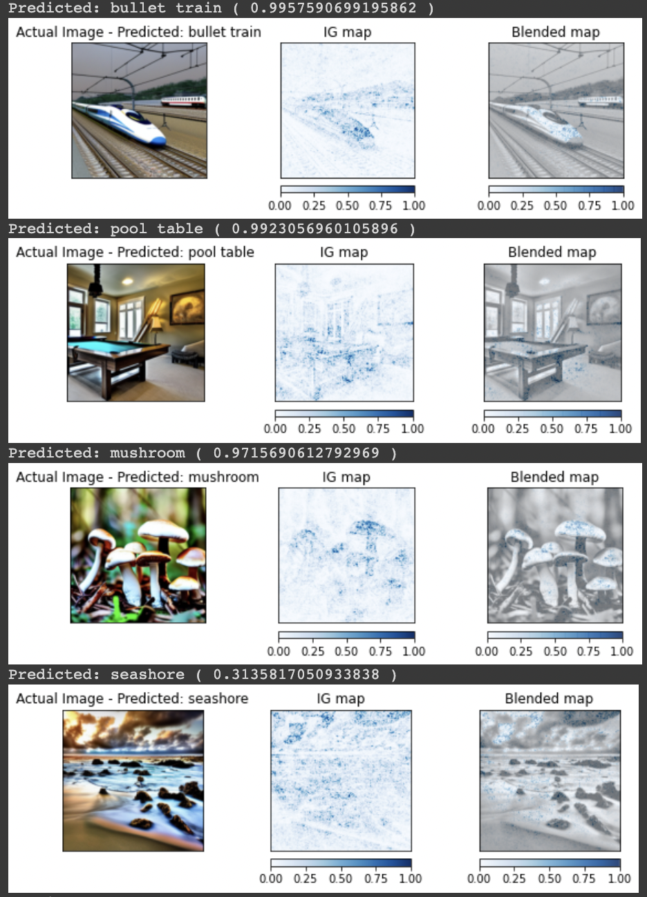
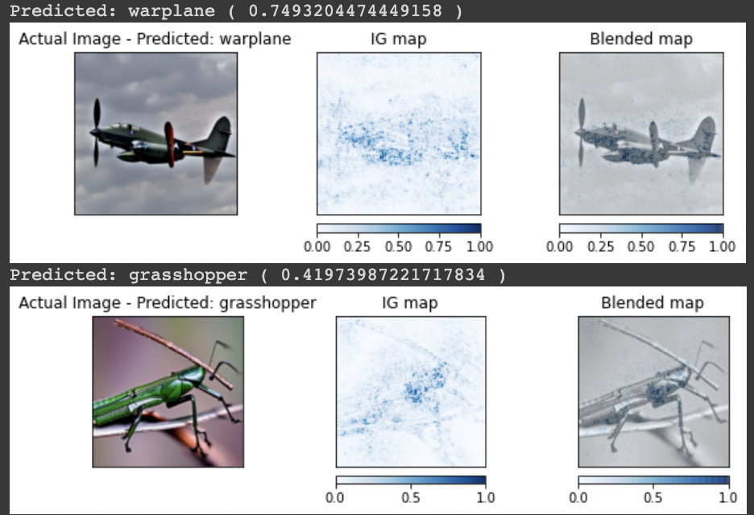

<table align="center"><tr><td align="center" width="9999">

# Model Explainability

Survey of different methods of model explainability in Computer Vision

## Integrated Gradients

</td></tr></table>

  
  

