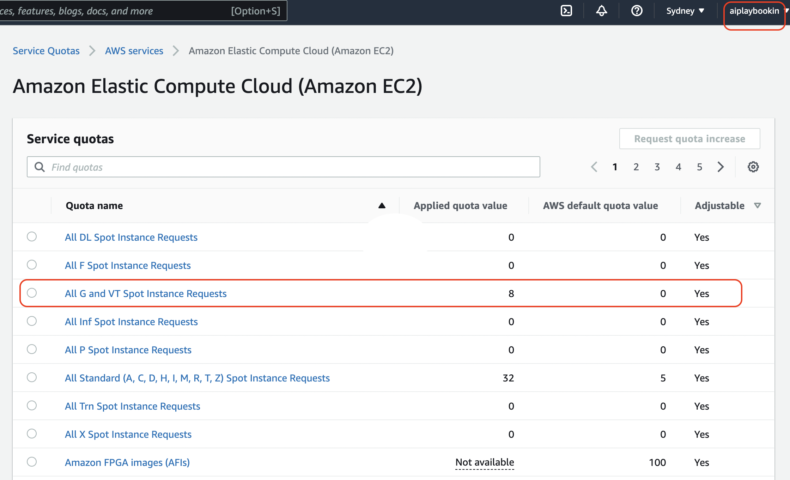

<table align="center"><tr><td align="center" width="9999">

# Distributed Training


</td></tr></table>

### To do
Model: timm.create_model("vit_base_patch32_224", pretrained=True)

Dataset: CIFAR10

Epochs: >25

1. Train ViT Base using **FSDP (4 GPU)**
2. Train ViT Base using **DDP (4 GPU x 2 Nodes)**
3. Use the highest batch_size possible for both strategies
4. Store the best checkpoint of both to AWS S3
5. In your repository add a training log book folder and create a .md file for above experiments
6. Add Model Validation Metrics, Training Time, GPU memory usage, GPU Utilization (nvidia-smi dump) for both strategies
 - you can run the testing script after training the model to get the final model metrics
7. Add the maximum batch_size number you were able to achieve
8. Upload Tensorboard logs to Tensorboard.dev and add link to it


# AWS Service Quota 🙏🏽



## For Multi node Multi GPU training

### A1. 
Create multi node instances say 2 instances, each ```g4dn.xlarge``` (See [here](https://github.com/aiplaybookin/MLOps/tree/main/05%20AWS%20Deployment#Launching%20an%20EC2%20instance) for how to launh ec2 instance instances)

NOTE : You have to select Ubuntu Deep Learning Pytorch image as AMI


### A2. 
Select Security group with access  -
```Type: Custom TCP```     ```Port range : 1000-65535``` for communication between nodes

NOTE : Remember to click on ```Advanced Details``` and request ```Spot Instance```

### A3. 
SSH from local machine

### A4. 
Enter into pytorch env
```source activate pytorch```

### A5. 
Install tmux
```
cd
git clone https://github.com/gpakosz/.tmux.git
ln -s -f .tmux/.tmux.conf
cp .tmux/.tmux.conf.local .
```

### A6. 
Create tmux session, e.g. work 
```
tmux new -s work
```

### A7. 
Clone the repo in both
```
git clone https://github.com/aiplaybookin/lightning-hydra-template.git
```

### A8. 
Install all required packages
```
cd lightning-hydra-template
pip install -r requirements.txt
```

### A9. 
Changes in code

When logging on epoch level in distributed setting to accumulate the metric across devices. e.g. 
self.log('train/acc', ..., ```sync_dist=True```)

NOTE : Both should have same code /files

Change the batch size to 256

Change min/ max epoch to whatever you can 🎃🤑

enable ```logger=tensorboard```

node num >0


### A10. 
Specify Master Node as one of them and use below. You can change port and try if failing. Place Private IP addr

Use ```hostname``` to get Private IPv4 addresses 

We are having 2 nodes so ```trainer.num_nodes=2```

We have only one GPU in each so ```trainer.devices=1``` . Change it as per your machine choosen.

***MASTER_PORT*** - required; has to be a free port on machine with NODE_RANK 0

***MASTER_ADDR*** - required (except for NODE_RANK 0); address of NODE_RANK 0 node

***WORLD_SIZE*** - required; how many nodes are in the cluster

***NODE_RANK*** - required; id of the node in the cluster


***Place on Master Node***
```
MASTER_PORT=29501 MASTER_ADDR=172.31.9.56 WORLD_SIZE=2 NODE_RANK=0 python src/train.py experiment=cifar trainer=ddp trainer.devices=1 trainer.num_nodes=2 trainer.default_root_dir=$(date +%Y-%m-%d_%H-%M-%S) callbacks.model_checkpoint.dirpath=logs/train/runs datamodule.batch_size=384 trainer.min_epochs=1 trainer.max_epochs=10 model.net.model_name=vit_base_patch32_224
```

***Place on Worker Node***
```
MASTER_PORT=29501 MASTER_ADDR=172.31.9.56 WORLD_SIZE=2 NODE_RANK=1 python src/train.py experiment=cifar trainer=ddp trainer.devices=1 trainer.num_nodes=2 trainer.default_root_dir=$(date +%Y-%m-%d_%H-%M-%S) callbacks.model_checkpoint.dirpath=logs/train/runs datamodule.batch_size=384 trainer.min_epochs=1 trainer.max_epochs=10 model.net.model_name=vit_base_patch32_224
```

### A11

While Running epoch Output can be seen on master node

### A12
100% utilization of GPUs in both nodes


### A13
- Model : ```vit_base_patch32_224```

- Dataset : ```CIFAR10```

- Batch Size : ```384```, two instance so 192 on each 

- Epochs : ```10```

- Val/Acc_best: ```0.637```

- Execution time: ```42 mins```, [logs here](./resources/exec_time.log)

- Configs [here](./resources/config_tree.log)

- Tensorboard logs [here](./resources/tensorboard/)

- Model placed in S3 : [download](s3://mlops-tutorials/epoch_009.ckpt)


## Others -

Use tmux sessions
[Refer](https://github.com/aiplaybookin/MLOps/tree/main/05%20AWS%20Deployment#TMUX)

To download from EC2 to Local machine
```
scp -i <>.pem -r ubuntu@3.25.219.108:lightning-hydra-template/logs/train/runs/ Downloads/runs
```