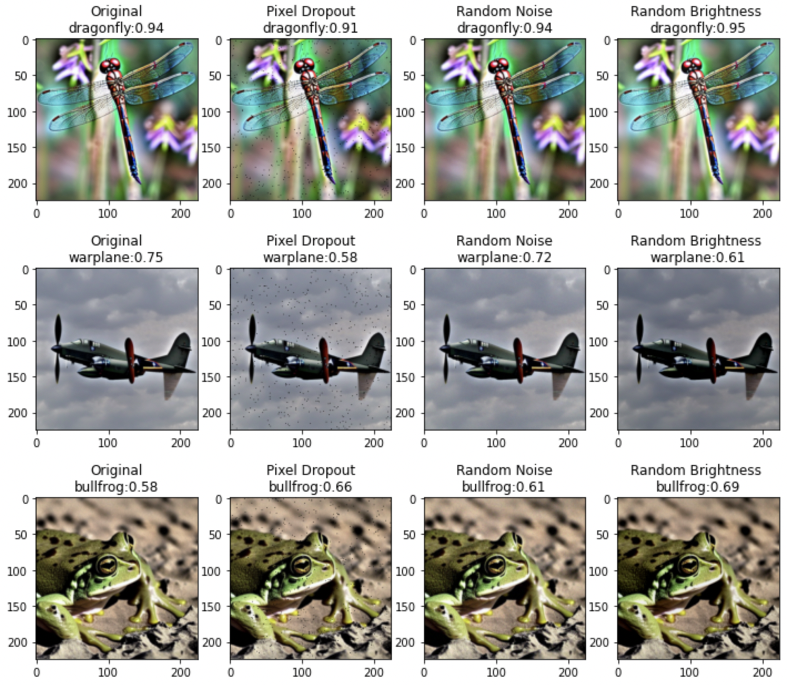
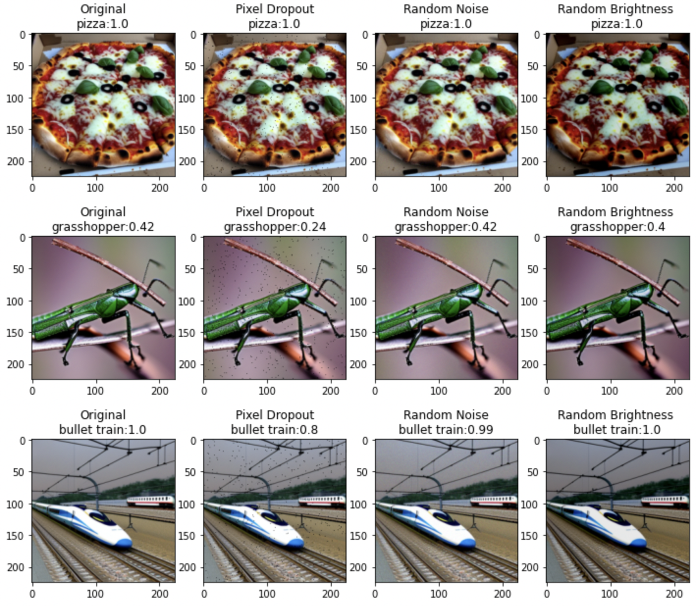
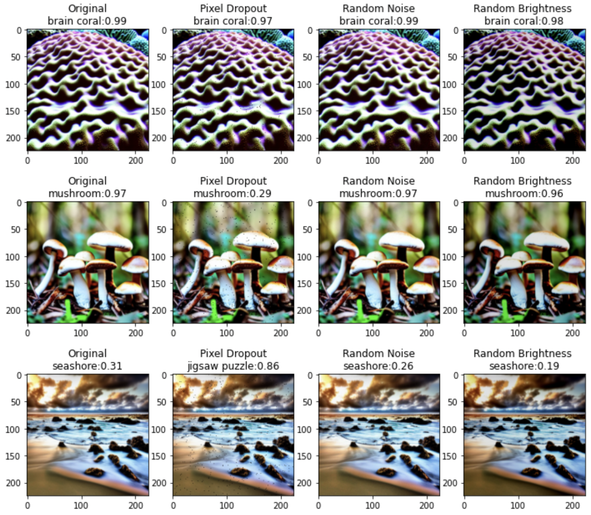
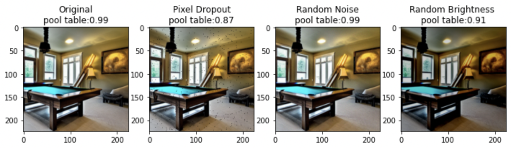

<table align="center"><tr><td align="center" width="9999">

# Model Explainability

Survey of different methods of model explainability in Computer Vision

</td></tr></table>

<table align="center"><tr><td align="left" width="9999">

# To generate explainability results

1. Generate images from [DreamStudio by Stability AI (using stable diffusion model)](https://beta.dreamstudio.ai/)
2. Place test images in ```logbook/images/``` folder
3. 

- Run notebook placed in ```notebook``` folder [here](https://github.com/aiplaybookin/lightning-hydra-template/tree/main/logbook/notebook)

OR

- Run ```python3 src/explain.py``` with model path or use timm models
   - Resulting images will be generated and stored in ```logbook/outputs/```
- Run ```python3 src/robustness.py```
   - Resulting images will be generated and stored in ```logbook/outputs/```

</td></tr></table>

<table align="center"><tr><td align="center" width="9999">

# Results 

## Integrated Gradients


## Integrated Gradients with Noise Tunnel


## SHAP


## Occlusion


## Grad CAM & CAM++

Note : Grad CAM++ works well with multiple items, see mushrooms


# Model Robustness

</td></tr></table>

<table align="center"><tr><td align="left" width="9999">

Use of [Albumentation](https://albumentations.ai) for transformations
- Random Pixel Dropout
- Random Noise ( Gaussian)
- Random Brightness


</td></tr></table>


<table align="center"><tr><td align="center" width="9999">






</td></tr></table>

