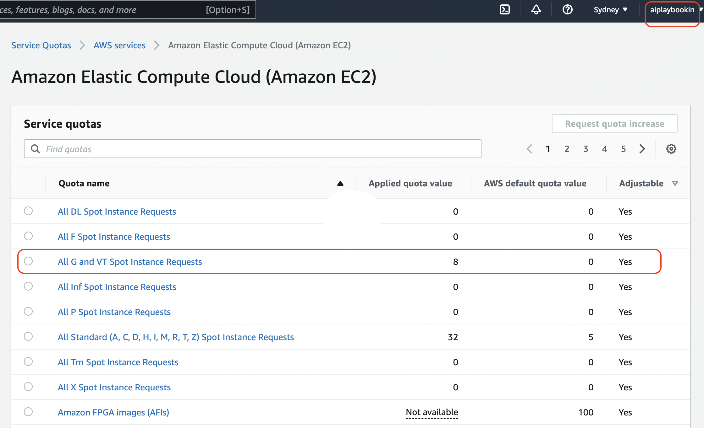

<table align="center"><tr><td align="center" width="9999">

# Distributed Training


</td></tr></table>

### To do
Model: timm.create_model("vit_base_patch32_224", pretrained=True)

Dataset: CIFAR10

Epochs: >25

1. Train ViT Base using **FSDP (4 GPU)**
2. Train ViT Base using **DDP (4 GPU x 2 Nodes)**
3. Use the highest batch_size possible for both strategies
4. Store the best checkpoint of both to AWS S3
5. In your repository add a training log book folder and create a .md file for above experiments
6. Add Model Validation Metrics, Training Time, GPU memory usage, GPU Utilization (nvidia-smi dump) for both strategies
 - you can run the testing script after training the model to get the final model metrics
7. Add the maximum batch_size number you were able to achieve
8. Upload Tensorboard logs to Tensorboard.dev and add link to it


# IN Progress 🙏🏽



## For Multi node Multi GPU training

A1. Create multi node instances say 2, each ```g4dn.xlarge``` (See step above, just need to add 2 or more instances)

A2. Security group should have -
```Type: Custom TCP```     ```Port range : 1000-65535``` for communication between nodes

A3. SSH from local machine

A4. source activate pytorch

A5. Install tmux
```
cd
git clone https://github.com/gpakosz/.tmux.git
ln -s -f .tmux/.tmux.conf
cp .tmux/.tmux.conf.local .
```

A6. Create tmux session, e.g. work 
```
tmux new -s work
```

A7. Clone the repo in both
```
git clone https://github.com/aiplaybookin/lightning-hydra-template.git
```

A8. Install all required packages
```
cd lightning-hydra-template
pip install -r requirements.txt
```

A9. Changes in code

When logging on epoch level in distributed setting to accumulate the metric across devices. e.g. 
self.log('train/acc', ..., ```sync_dist=True```)

NOTE : Both should have same code /files

Change the batch size to 256

Change min/ max epoch to 

enable ```logger=tensorboard```

Comment code for test in node num >0


A10. Master Node, can change port and try. Place Private IP addr

Use ```hostname``` to get Private IPv4 addresses 
```
MASTER_PORT=29500 MASTER_ADDR=<Private IPv4 addresses> WORLD_SIZE=2 NODE_RANK=0 python src/train.py trainer=ddp trainer.devices=1 trainer.num_nodes=2
```

MASTER_PORT=29500 MASTER_ADDR=172.31.31.106 WORLD_SIZE=2 NODE_RANK=0 python src/train.py trainer=ddp trainer.devices=1 trainer.num_nodes=2 trainer.default_root_dir=$(date +%Y-%m-%d_%H-%M-%S) callbacks.model_checkpoint.dirpath=logs/train/runs 

MASTER_PORT=29500 MASTER_ADDR=172.31.31.106 WORLD_SIZE=2 NODE_RANK=1 python src/train.py trainer=ddp trainer.devices=1 trainer.num_nodes=2 trainer.default_root_dir=$(date +%Y-%m-%d_%H-%M-%S) callbacks.model_checkpoint.dirpath=logs/train/runs 


MASTER_PORT=29500 MASTER_ADDR=172.31.47.238 WORLD_SIZE=2 NODE_RANK=0 python src/train.py trainer=ddp trainer.devices=1 trainer.max_epochs=2 trainer.num_nodes=2 trainer.default_root_dir=$(date +%Y-%m-%d_%H-%M-%S) callbacks.model_checkpoint.dirpath=logs/train/runs 

MASTER_PORT=29500 MASTER_ADDR=172.31.47.238 WORLD_SIZE=2 NODE_RANK=1 python src/train.py trainer=ddp trainer.devices=1 trainer.max_epochs=2 trainer.num_nodes=2 trainer.default_root_dir=$(date +%Y-%m-%d_%H-%M-%S) callbacks.model_checkpoint.dirpath=logs/train/runs

While Running epoch Output can be seen on master node

Use tmux sessions
[Refer](https://github.com/aiplaybookin/MLOps/tree/main/05%20AWS%20Deployment#TMUX)
